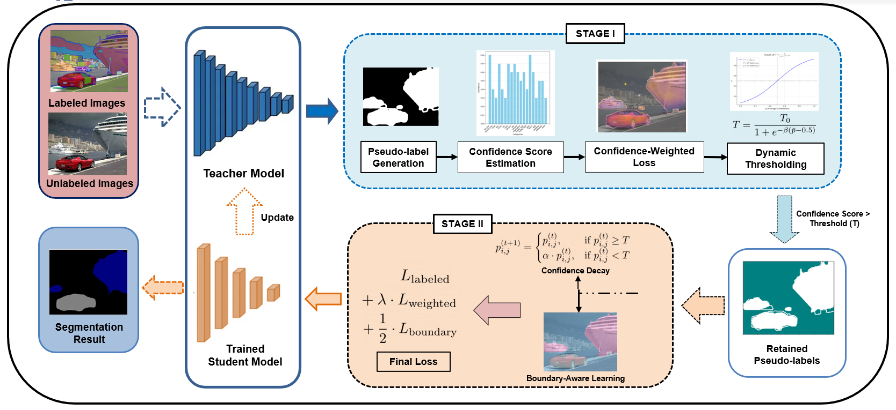
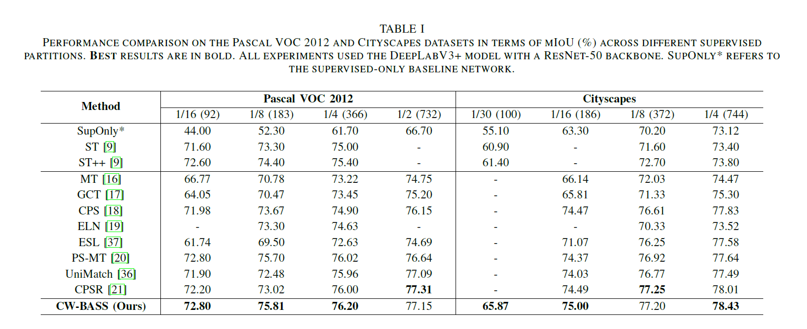
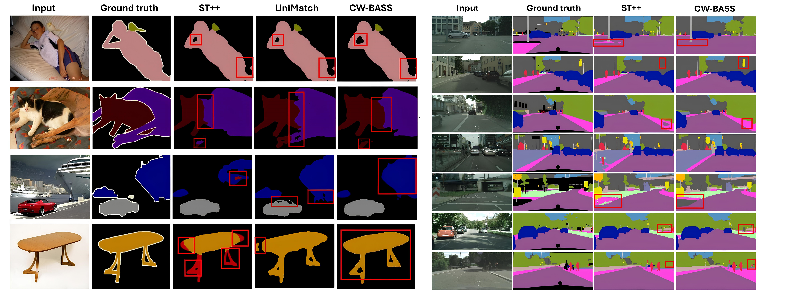

# CW-BASS: Confidence-Weighted Boundary-Aware Learning for Semi-Supervised Semantic Segmentation

[](https://doi.org/10.1109/IJCNN64981.2025.11227871)
-00629B.svg)
[](https://arxiv.org/abs/2502.15152)
[](https://psychofict.github.io/CW-BASS/)
[](LICENSE)
[](https://pytorch.org/)

Official PyTorch implementation of our **IJCNN 2025** paper:

> **CW-BASS: Confidence-Weighted Boundary-Aware Learning for Semi-Supervised Semantic Segmentation**
> Ebenezer Tarubinga, Jenifer Kalafatovich, Seong-Whan Lee — *Pattern Recognition & Machine Learning Lab, Korea University*

📄 [Paper (IEEE Xplore)](https://doi.org/10.1109/IJCNN64981.2025.11227871) · 📝 [arXiv](https://arxiv.org/abs/2502.15152) · 🌐 [Project Page](https://psychofict.github.io/CW-BASS/)



---

## Table of Contents
- [Abstract](#abstract)
- [Key Contributions](#key-contributions)
- [Results](#results)
- [Installation](#installation)
- [Data Preparation](#data-preparation)
- [Training](#training)
- [Pseudo-Labeling & Retraining](#pseudo-labeling--retraining)
- [Repository Structure](#repository-structure)
- [Acknowledgements](#acknowledgements)
- [Citation](#citation)
- [License](#license)

## Abstract

Semi-supervised semantic segmentation (SSSS) aims to improve segmentation performance by
utilizing large amounts of unlabeled data with limited labeled samples. Existing methods
often suffer from **coupling**, where over-reliance on initial labeled data leads to
suboptimal learning; **confirmation bias**, where incorrect predictions reinforce themselves
repeatedly; and **boundary blur** caused by limited boundary-awareness and ambiguous edge
cues. To address these issues, we propose CW-BASS, a novel framework for SSSS. We assign
confidence weights to pseudo-labels to mitigate the impact of incorrect predictions, and
leverage boundary-delineation techniques that remain underutilized in SSSS. Extensive
experiments on Pascal VOC 2012 and Cityscapes demonstrate that CW-BASS achieves
state-of-the-art performance. Notably, CW-BASS achieves a **65.9% mIoU on Cityscapes** under
a challenging 1/30 split (100 images), highlighting its effectiveness in limited-label settings.

## Key Contributions

1. **Confidence-Weighted Loss** — reduces *coupling* by adjusting pseudo-label influence based on predicted confidence scores, downweighting unreliable predictions.
2. **Dynamic Thresholding** — mitigates *confirmation bias* with an adaptive mechanism that filters pseudo-labels based on model performance.
3. **Boundary-Aware Module** — tackles *boundary blur* using explicit (Sobel-based) boundary supervision to refine segmentation near object edges.
4. **Confidence Decay** — reduces label noise through a progressive strategy that refines pseudo-label confidence during training.

## Results

All experiments use **DeepLabV3+ with a ResNet backbone**. mIoU (%) on the standard SSSS splits:

| Setting | Split | Labeled images | mIoU |
|---|---|---|---|
| Cityscapes | 1/30 | 100 (3.3%) | **65.9** |
| Cityscapes | 1/4  | —           | **78.4** |
| Pascal VOC 2012 | 1/4 | —       | **76.2** |

See the [project page](https://psychofict.github.io/CW-BASS/) and the [paper](https://doi.org/10.1109/IJCNN64981.2025.11227871) for the full comparison against prior methods and all label partitions.



<p align="center"><em>Qualitative comparison — CW-BASS produces sharper object boundaries.</em></p>



## Installation

```bash
git clone https://github.com/psychofict/CW-BASS.git
cd CW-BASS
pip install -r requirements.txt
```

Requirements: Python ≥ 3.8, PyTorch ≥ 1.10 with a CUDA-capable GPU (multi-GPU training is
supported via `DataParallel`). See [`requirements.txt`](requirements.txt) for the full list.

## Data Preparation

### Pre-trained backbones

[ResNet-50](https://download.pytorch.org/models/resnet50-0676ba61.pth) | [DeepLabv2-ResNet-101](https://drive.google.com/file/d/14be0R1544P5hBmpmtr8q5KeRAvGunc6i/view?usp=sharing)

### Datasets

[Pascal JPEGImages](http://host.robots.ox.ac.uk/pascal/VOC/voc2012/VOCtrainval_11-May-2012.tar) | [Pascal SegmentationClass](https://drive.google.com/file/d/1ikrDlsai5QSf2GiSUR3f8PZUzyTubcuF/view?usp=sharing) | [Cityscapes leftImg8bit](https://www.cityscapes-dataset.com/file-handling/?packageID=3) | [Cityscapes gtFine](https://drive.google.com/file/d/1E_27g9tuHm6baBqcA7jct_jqcGA89QPm/view?usp=sharing)

### File organization

```
├── ./pretrained
│   ├── resnet50.pth
│   └── deeplabv2_resnet101_coco_pretrained.pth
│
├── [Your Pascal Path]
│   ├── JPEGImages
│   └── SegmentationClass
│
└── [Your Cityscapes Path]
    ├── leftImg8bit
    └── gtFine
```

The labeled/unlabeled ID splits for every partition ship with the repo under
[`dataset/splits/`](dataset/splits/) — no extra setup required.

## Training

```bash
export semi_setting='pascal/1_8/split_0'

CUDA_VISIBLE_DEVICES=0,1 python -W ignore main.py \
  --dataset pascal --data-root [Your Pascal Path] \
  --batch-size 16 --backbone resnet50 --model deeplabv3plus \
  --labeled-id-path dataset/splits/$semi_setting/labeled.txt \
  --unlabeled-id-path dataset/splits/$semi_setting/unlabeled.txt \
  --pseudo-mask-path outdir/pseudo_masks/$semi_setting \
  --save-path outdir/models/$semi_setting
```

Dataset-specific defaults (epochs, learning rate, crop size) are applied automatically; the
CW-BASS hyper-parameters can be overridden on the command line:

| Flag | Default | Description |
|---|---|---|
| `--gamma` | 1.0 | Confidence-weighting exponent in the weighted CE loss |
| `--base-threshold` | 0.6 | Base value for the dynamic confidence threshold |
| `--beta` | 0.5 | Sensitivity of the dynamic threshold to mean confidence |
| `--decay-factor` | 0.9 | Multiplicative confidence-decay factor |
| `--use-confidence-decay` | off | Enable progressive confidence decay |
| `--config` | none | Optional YAML (see [`configs/`](configs/)) to override defaults |

The best checkpoint (by validation mIoU) is written to `--save-path`. Use `--resume <ckpt>`
to continue training from a saved checkpoint.

## Pseudo-Labeling & Retraining

`main.py` also provides ST++-style utilities to select reliable unlabeled images, generate
pseudo-masks, and retrain on the labeled + pseudo-labeled union (see `select_reliable`,
`label`, and `retrain_on_pseudo_labeled_data`).

## Repository Structure

```
CW-BASS/
├── main.py                 # Training / pseudo-labeling entry point
├── utils.py                # mIoU metric, param counting, color maps
├── configs/                # Per-dataset YAML configs
├── dataset/
│   ├── semi.py             # SemiDataset (labeled / unlabeled / val)
│   ├── transform.py        # Augmentations (crop, flip, resize, blur, cutout)
│   └── splits/             # Labeled / unlabeled ID lists per partition
├── model/
│   ├── backbone/           # ResNet backbones
│   └── semseg/             # DeepLabV3+, DeepLabV2, PSPNet
├── entropy_cityscapes.py   # Analysis: entropy maps
├── entropy_map_pascal.py
├── gt_vs_pred_cityscapes.py# Analysis: GT vs prediction visualizations
├── gt_vs_pred_pascal.py
└── docs/                   # Project page (GitHub Pages)
```

## Acknowledgements

The image partitions are borrowed from **Context-Aware-Consistency** and **PseudoSeg**.
Part of the training hyper-parameters and network structures are adapted from **ST++** and
**PyTorch-Encoding**.

+ ST++: https://github.com/LiheYoung/ST-PlusPlus
+ Context-Aware-Consistency: https://github.com/dvlab-research/Context-Aware-Consistency
+ PyTorch-Encoding: https://github.com/zhanghang1989/PyTorch-Encoding
+ OpenSelfSup: https://github.com/open-mmlab/OpenSelfSup

## Citation

If you find this project useful, please consider citing:

```bibtex
@inproceedings{tarubinga2025cwbass,
  author={Tarubinga, Ebenezer and Kalafatovich, Jenifer and Lee, Seong-Whan},
  booktitle={2025 International Joint Conference on Neural Networks (IJCNN)},
  title={CW-BASS: Confidence-Weighted Boundary-Aware Learning for Semi-Supervised Semantic Segmentation},
  year={2025},
  pages={1-8},
  doi={10.1109/IJCNN64981.2025.11227871}
}
```

## License

Released under the [MIT License](LICENSE).
